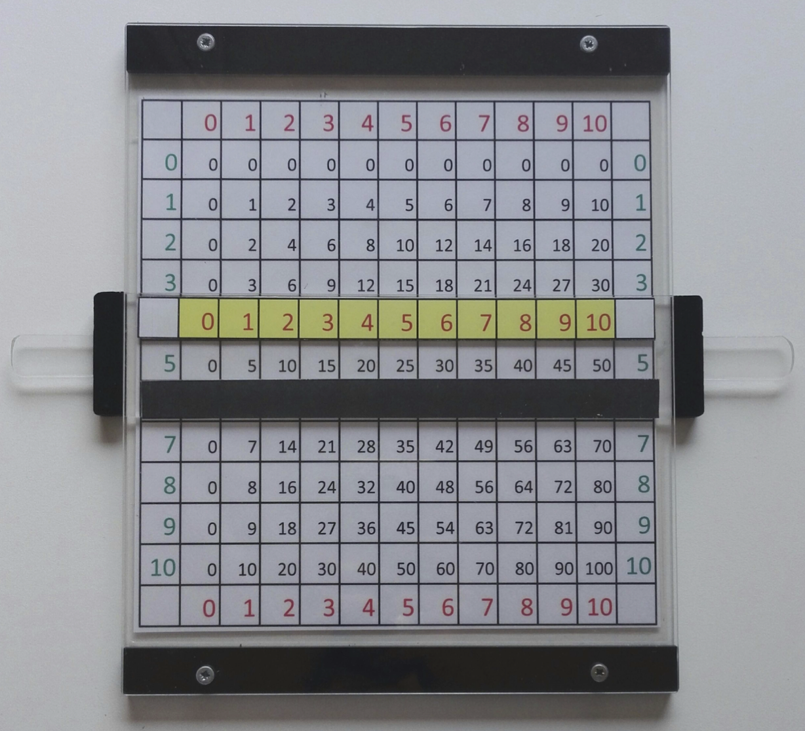

# La Tavola Pitagorica di Gaia

Nel corso del progetto di Hackability@Polito è stato creato questo prototipo di Tavola Pitagorica.
La tavola si propone come strumento compensativo a sostegno dell'apprendimento e nasce dalla necessità di sostenere la funzionalità visiva e l'abilità prassica di bambini che presentano disturbi visuopercettivi e difficoltà specifica nei movimenti oculari fini nei primi anni dell'apprendimento.
Lo studio della matematica richiede un alto livello di pianificazione, quindi il coinvolgimento di più domini neuropsicologici: sono interessati il campo della pianificazione, della memoria di lavoro, dell'attenzione, della memorizzazione effettiva della tabellina. Nei soggetti con difficoltà di apprendimento queste operazioni vanno vicariate con oggetti compensativi.

La tavola è composta da due rettangoli di plexiglass sovrapposti ed uniti da viti; tra di esse vi sono una stampa di tavola pitagorica e una mascherina scorrevole, anch'essa in plexiglass, che copre tre righe della tavola:
1. la prima riga riporta l'indicazione della colonna corrispondente;
2. la seconda riga è completamente trasparente al fine di rendere possibile la visione del risultato dell'operazione;
3. la terza riga è oscurata per focalizzare l'attenzione sul risultato.

#Sviluppatore
- Gaia Marchetti
